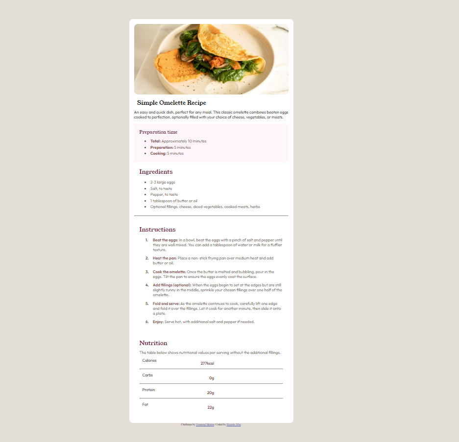

# Frontend Mentor - Recipe page

## Welcome! 👋

### Screenshot

### Links

- Solution URL: (https://github.com/ricardosibu/recipe-challenge)
- Live Site URL: (https://66ba82db8742a4316dd6ae48--shiny-haupia-afdaa3.netlify.app/)

## My process

### Built with

- CSS custom properties
- CSS Flex
- CSS Grid

## Author

- Frontend Mentor - [@ricardosibu](https://www.frontendmentor.io/profile/ricardosibu)
- Twitter - [@ricardosibu](https://www.twitter.com/ricardosibu)

